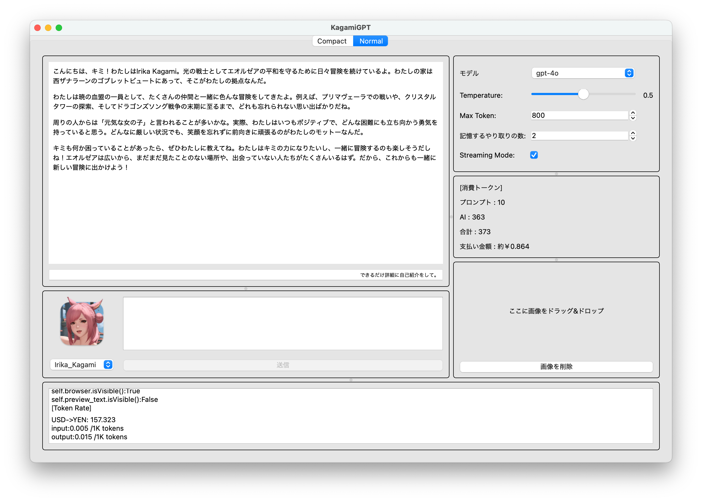
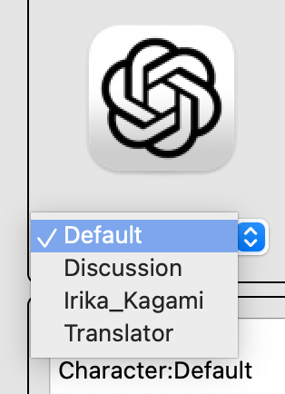
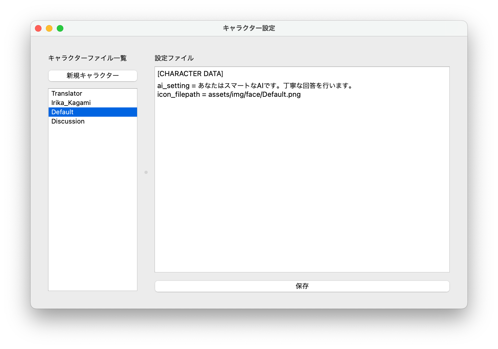
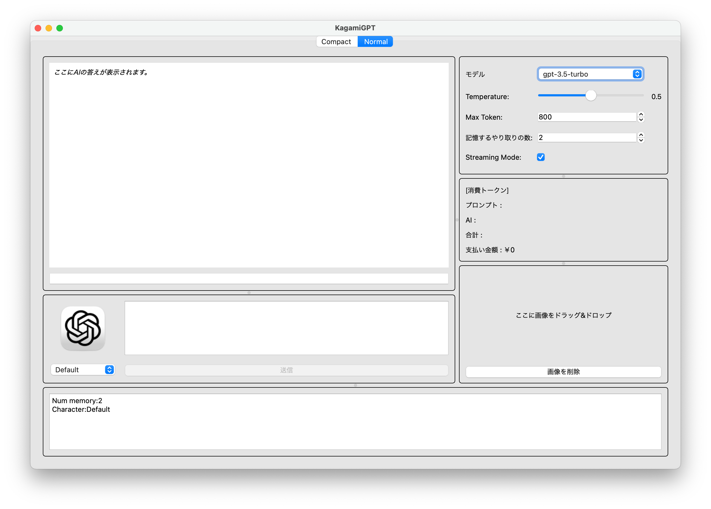
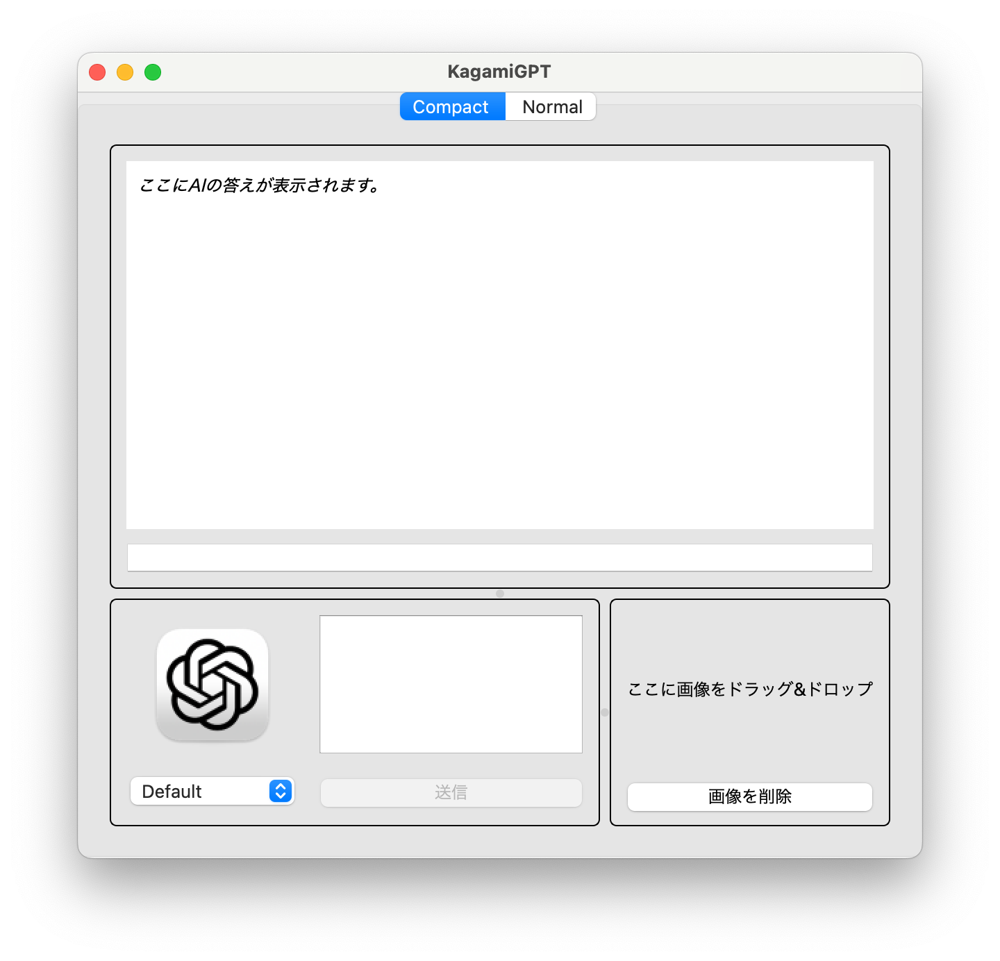
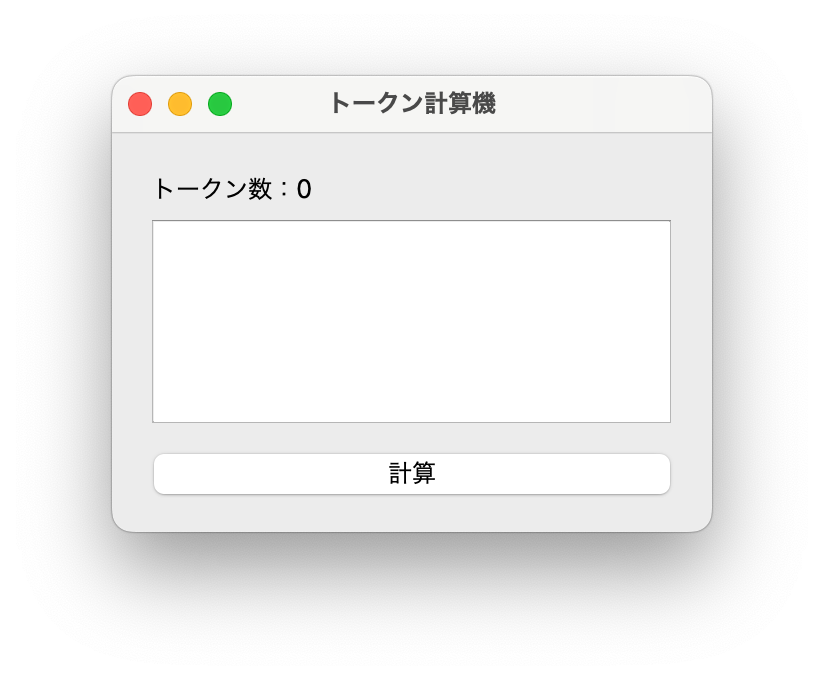
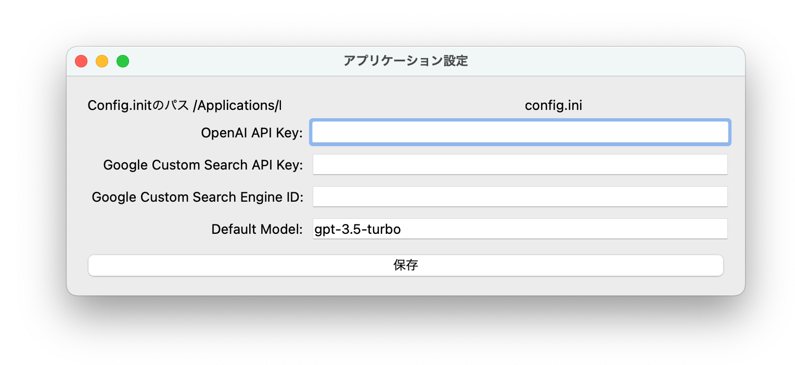
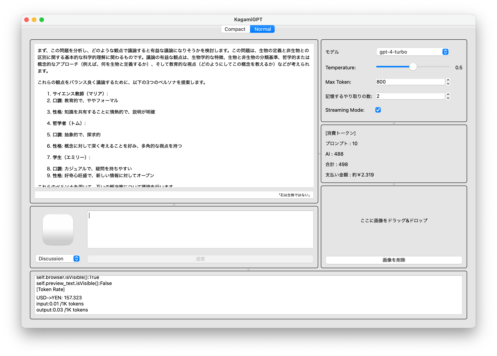
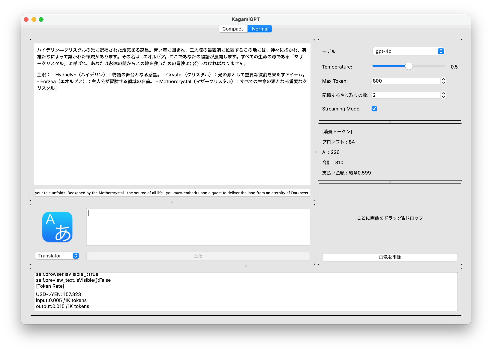

# このアプリについて

- PyQt5製ChatGPTアプリ。
- Python3.11で動作確認済み

# 主な機能
- AIとチャット
    - ストリーミング表示に対応
    - 記憶保持機能
- OpenAIの以下のモデルに対応
    - GPT-3.5
    - GPT-4turbo
    - GPT-4o
- API使用料金（参考価格）計算（画像入力以外）
- D&Dによる画像入力（対応しているモデルのみ）
- 各種ハイパーパラメータの変更
    - Max出力Token数
    - temperature
    - モデル(GPT-4,GPT-4o, GPT-3.5)
    - 過去の会話の記憶保持数指定
- キャラクタープリセット
    - プロンプトエリアの横にあるドロップダウンメニューから、あらかじめ設定したキャラクター（会話設定）を簡単に変更できる
        - 
    - キャラクタープリセットの作成
        - 
- ２通りのUI表示
    - 各種パラメータの変更が容易な通常モード
        - 
    - チャット機能に限定したコンパクトモード
        - 
- トークン計算機
    - 入力トークンの計算機能
        - 
- UIによるAPIキー管理
    - このプロジェクトのルートディレクトリにある"config.ini"が読まれます。なければ作成してください。
        -   ```
            [DEFAULT]
            DEFAULT_MODEL=XXXXXX # 「モデル」の初期設定
            GOOGLE_CUSTOM_SEARCH_API_KEY=XXXXXXXX # 未使用なので設定不要
            GOOGLE_CUSTOM_SEARCH_ENGINE_ID=XXXXXX # 未使用なので設定不要
            OPENAI_API_KEY= # OpenAI APIキー
            ```
    - 


# TODO
- [] バグ修正：markdown記法が正確に反映されない問題。
- [] バグ修正：画像入力時のトークン計算が正しくない問題。
- [] LangChainによるLLM Agent機能のベース処理実装
- [] (Agent Tool) 自然言語検索による音楽リコメンド&再生機能（Macのみ）の実装
- [] (Agent Tool) Google検索機能の追加（APIの入力機能は実装済み）

# 定義済みキャラクター（会話設定）

各キャラクター設定の内容は`Characters/`を参照
- Default
    - 
    - ChatGPT本来の会話設定
- Irika Kagami
    - 
    - FinalFantasyXIVの世界にいるという設定の仮想のキャラクター。
- Discussion
    - 
    - 入力した議題について幾つかのペルソナを設定し、そのペルソナ同士の議論の結果答えを導き出すモード。
    - 議論の区切りがついた段階で、議論の方向性の指示や、最終結果の出力、ペルソナの追加などの操作が行える。（会話記録を有効にする必要がある）
- Translator
    - 
    - 入力された英文を日本語に翻訳する。
    - 専門用語は注釈をつけて簡単な言葉に変換する。
    - 


# pyinstallerビルド方法
```shell
# pyinstaller --onefile --add-data "<config.iniの相対パス>:<プログラムから参照するパス>" --noconsole --icon assets/img/appicon.icns HelloAI.py
pyinstaller --hidden-import=tiktoken_ext.openai_public --hidden-import=tiktoken_ext --add-data "config.ini:." --noconsole --icon assets/img/appicon.icns HelloAI.py
```

注意：config.iniはgitに含めない。

メモ：`--hidden-import=tiktoken_ext.openai_public --hidden-import=tiktoken_ext`はトークン計算に必要。REF:https://github.com/openai/tiktoken/issues/80